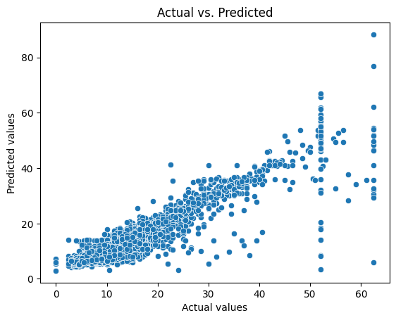

# NYC TLC Regression Model Project: README

Predicting taxi rider fare

## Overview

The purpose of this project is to predict future taxi ride fare based on taxi rider data from the New York City Taxi and Limousine Commission (NYC TLC), in order to optimize revenue for this company. To this end, this project seeks to build a multiple linear regression model with several different variables related to ride fare, which can be used to explain the variables most closely related to ride fare.

## Business Understanding

It can be a challenge for taxi companies to understand the factors that influence taxi rider behavior. If other taxi rider data points can be collected prior to their ride, and their ride fare can be predicted based on these data points, the NYC TLC can make more data-driven decisions for their company.

## Data Understanding

The original data was collected from the NYC TLC website, and can be found [here](https://www.nyc.gov/site/tlc/about/tlc-trip-record-data.page). The dataset includes over 20,000 unique taxi rides with 18 different features such as ride fare, ride distance, pickup and dropoff times, the number of passengers, payment type, and tip amount.

## Modeling and Evaluation

The multiple linear regression model used to predict ride fare had an r-squared score of approximately 0.8683, indicating that the model explains about 86.83% of the variation of ride fare amount. The strongest predictor of ride fare amount was average ride distance, followed by average ride duration. Other independent variables in the model included passenger count, the presence/absence of rush hour, and the vendor of the ride.

A scatter plot of the actual vs. predicted values of ride fare is shown below:

## Conclusion

The model can be used to help NYC TLC make more data-driven decisions, such as incentivizing taxi rides for longer distances. Additionally, further research can be conducted on ride distance and ride duration, since these variables are most closely associated with ride fare.